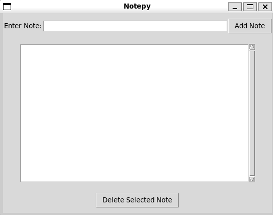

# ABOUT

**This is `notepy`, a simple note GUI application that saves notes automaticly in `notes.txt`!**

------
# REQUIREMENTS

~ `Python3`

~ `Git`

~ `Linux GUI enabled`
------
# CLONING

~ To clone this repository, simply type:

    git clone https://github.com/tkemza/notepy.git
------
# SCRIPTRUNNER

~ Enter a script directory by typing:

    cd notepy

~ You can run this script using `Shell` or `Python`!

~ Run script using `Python`:

    python3 note.py

~ Run script using `Shell` (`chmod +x noterunner.sh`):

    bash noterunner.sh

------
# USAGE 

~ You can write notes in `text input` section 

~ After you finish, click on `Add Note` and it will add your note!

~ You can delete a note by clicking on `note` that you have made, and click `Delete Selected Note`

------
# PREVIEW

~ Here is a `PREVIEW` of script:

------
# MIT LICENSE

(`LICENSE.md`)

`tkemza`
